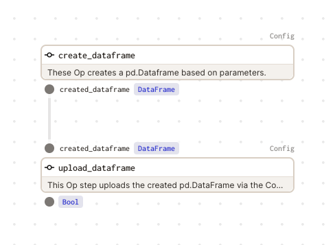
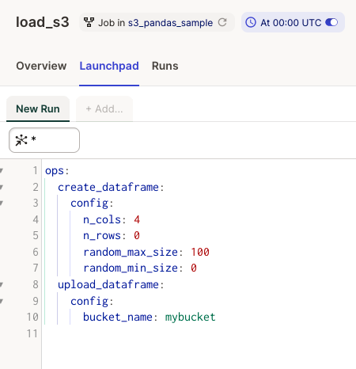

# Dagster Example for Demonstrating the Interaction of Code Location IAM Roles with S3

## Description

This example shows a Dagster Job example based on two Op steps. 

The First op step creates a pd.DataFrame based on 
Launchpad Parameters. The seconds OP step use the Code Location role to build and Amazon S3 boto3 Client to upload the 
created pd.DatFrame to a S3 Bucket.

Additionally, the example shows a Dockerfile which is enterprise-ready, in the meaning, that it implements proxies
and no-proxies settings as well as to reduce the privileges of the Unix user within the Code Location.

Finally, this examples show a sample of [Unittest](s3_pandas_sample_tests) based on the Give-When-Then-Strategy.
